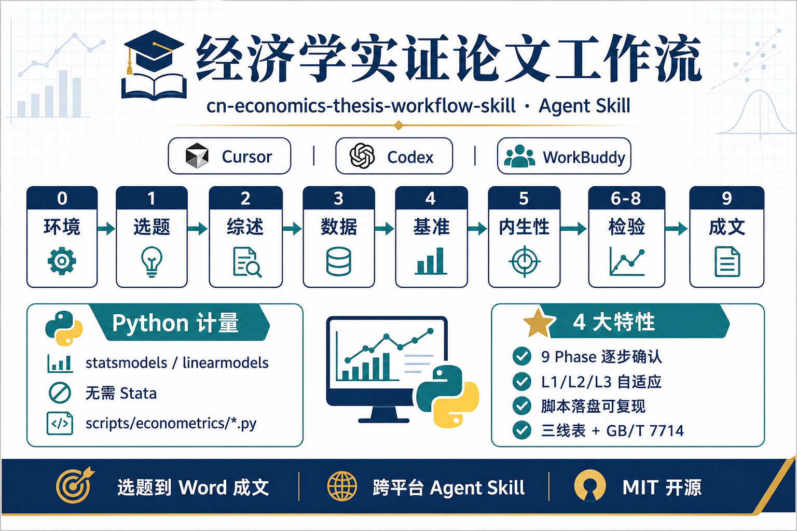

# 经济学实证论文工作流 Skill（Python 版）

<p align="center">
  
</p>

<p align="center">
  <strong>cn-economics-thesis-workflow-skill</strong><br>
  跨平台 Agent Skill · 9 阶段交互式流程 · Python 计量全栈 · <strong>无需 Stata</strong>
</p>

<p align="center">
  
  
  
  
  
  
  
  
</p>

---

## 一句话

**从选题到 Word 成文的分阶段论文教练**：文献与数据你主导，Agent 用 **Python（statsmodels + linearmodels）** 跑回归、出表、写正文。

---

## 30 秒了解

| | |
| --- | --- |
| **给谁** | 经管类本科/硕士实证论文、课程论文 |
| **解决什么** | 流程散、Stata 门槛高、AI 容易编造系数 |
| **怎么不同** | 9 Phase 逐步确认；脚本落盘可复现；Phase 5 后模型框架继承 |
| **运行环境** | Cursor / Codex / WorkBuddy / Claude Code / OpenCode / 通用 Agent |

---

## 9 阶段工作流

```
Phase 0 环境准备
    ↓
Phase 1 选题与文献定位 → Phase 2 文献综述与理论框架
    ↓
Phase 3 数据与变量
    ↓
Phase 4 基准回归 → Phase 5 内生性处理
    ↓
Phase 6 稳健性 ┐
Phase 7 机制检验 ├→ Phase 9 论文撰写与排版成文
Phase 8 异质性 ┘
```

| Phase | 做什么 | 产出 |
| ---: | --- | --- |
| 0 | Python 环境、项目目录、econ_utils | `scripts/` 骨架 |
| 1 | Semantic Scholar 选题、文献知识库 | 选题评估报告 |
| 2 | 精读 PDF、综述、研究假设 | 综述稿 + H1/H2 |
| 3 | 清洗数据、变量构造、描述统计 | `cleaned/dataset.parquet` |
| 4 | OLS / 面板 FE / TWFE | `output/tables/baseline.csv` |
| 5 | IV / DID / PSM 等 | `{{model_framework}}` |
| 6–8 | 稳健性、中介调节、异质性 | 扩展回归表 |
| 9 | 正文 + 三线表 + docx | `thesis/终稿.docx` |

用户水平 **L1 / L2 / L3** 自适应；**每 Phase 结束须确认**再进入下一阶段。

---

## 亮点

### Python 计量，不用 Stata

| 上游（Stata 版） | 本版（Python 版） |
| --- | --- |
| Stata + MCP | `statsmodels` + `linearmodels` |
| `.dta` 为主 | `parquet` / `csv` |
| `do/` 脚本 | `scripts/econometrics/*.py` |

### 模块化 + 跨平台

- `SKILL.md` 约 100 行核心流程，各 Phase 详解在 `reference-phase-*.md`
- 标准 [Agent Skills](https://agentskills.io) 格式，Cursor / Codex / WorkBuddy 均可安装
- 无 Shell 时降级：输出脚本 + 用户本地执行

### 可复现、不编造

- 回归结果以 `output/tables/*.csv` 为准
- 拒绝伪造系数；引用用 `[CIT:]` 占位后替换为真实文献

---

## 兼容平台

| 平台 | 个人级安装路径 | 调用 |
| --- | --- | --- |
| **Cursor** | `~/.cursor/skills/cn-economics-thesis-workflow-skill` | `/cn-economics-thesis-workflow-skill` |
| **Codex** | `~/.codex/skills/cn-economics-thesis-workflow-skill` | 对话说明「从 Phase 0 开始」 |
| **WorkBuddy** | `~/.workbuddy/skills/` 或 `~/.codebuddy/skills/` | @skill 或 trigger |
| **Claude Code** | `~/.claude/skills/cn-economics-thesis-workflow-skill` | @skill |
| **通用** | `~/.agents/skills/cn-economics-thesis-workflow-skill` | 按 description 触发 |

详见 [reference-platform.md](reference-platform.md)。

---

## 快速开始

```bash
git clone https://github.com/<YOUR_USERNAME>/cn-economics-thesis-workflow-skill.git \
  ~/.cursor/skills/cn-economics-thesis-workflow-skill

# 或其他平台
git clone <repo> ~/.codex/skills/cn-economics-thesis-workflow-skill
git clone <repo> ~/.agents/skills/cn-economics-thesis-workflow-skill
```

**调用示例：**

```text
按 cn-economics-thesis-workflow-skill 从 Phase 0 开始。
L2 水平，Y=企业创新，X=数字化转型，已有上市公司面板数据。
全部用 Python 计量，不用 Stata。
```

**前置依赖：**

```bash
pip3 install statsmodels linearmodels python-docx pandas numpy matplotlib seaborn scipy openpyxl pyarrow
```

---

## 文件结构

```
cn-economics-thesis-workflow-skill/
├── assets/
│   ├── thesis-workflow-infographic.png   # GitHub 横版（16:9）
│   └── thesis-workflow-xiaohongshu.png   # 小红书竖版（9:16）
├── SKILL.md                              # Agent 首读
├── reference-platform.md
├── reference-agent-capabilities.md
├── reference-phase-0.md … 9.md
├── reference-appendix-*.md
├── reference-rules.md
├── tests.md
└── LICENSE
```

---

## 版本

| 版本 | 说明 |
| --- | --- |
| **v2.0** | 模块化拆分；跨平台；信息图 README |
| v1.0 | Python 计量版 fork 自 ZehChou |

---

## 传播素材（小红书 / 公众号）

| 用途 | 文件 | 比例 |
| --- | --- | --- |
| GitHub / 公众号头图 | [`assets/thesis-workflow-infographic.png`](assets/thesis-workflow-infographic.png) | 16:9 |
| 小红书 / 朋友圈 | [`assets/thesis-workflow-xiaohongshu.png`](assets/thesis-workflow-xiaohongshu.png) | 9:16 |

<p align="center">
  
</p>

**标题建议**

- 不用 Stata 也能写实证论文？这个 Agent Skill 用 Python 跑完全流程
- 经管论文 9 阶段教练：选题到 Word 成文
- Cursor / Codex 都能装的经济学论文工作流

**正文模板**

```text
安利一个经济学实证论文 Agent Skill：cn-economics-thesis-workflow-skill

✅ 9 个 Phase 逐步确认，不会 AI 胡编回归系数
✅ Python 全栈：statsmodels + linearmodels，不用 Stata
✅ 脚本落盘可复现，output/tables 出 CSV 回归表
✅ Cursor / Codex / WorkBuddy 都能装

安装：git clone 到对应平台 skills 目录
调用：从 Phase 0 开始，说明 Y/X 和数据情况

开源 MIT，fork 自 ZehChou 原版
```

**标签**

`#经济学论文` `#实证分析` `#计量经济学` `#AgentSkill` `#Python` `#毕业论文` `#经管` `#Cursor` `#Codex`

---

## 致谢

- [ZehChou/cn-economics-thesis-workflow-skill](https://github.com/ZehChou/cn-economics-thesis-workflow-skill)
- [easy-paper](https://github.com/Dawnfz-Lenfeng/easy-paper)
- [docx-skill-4-cn-paper](https://github.com/Gostyan/docx-skill-4-cn-paper)

## 许可证

MIT
